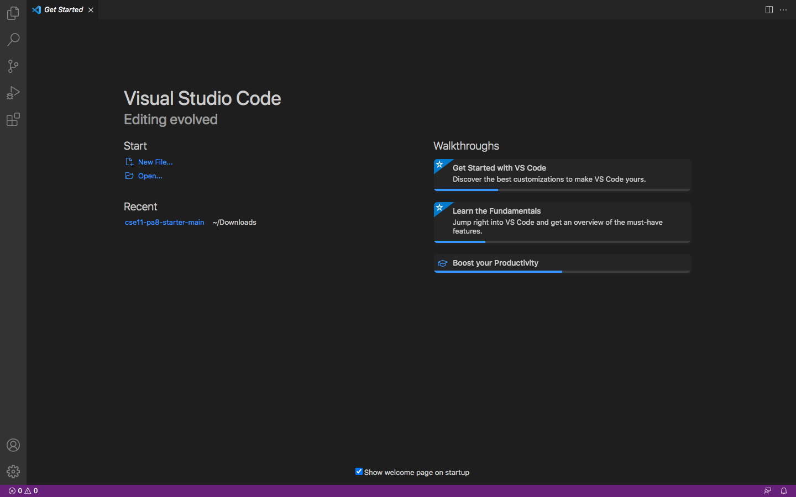
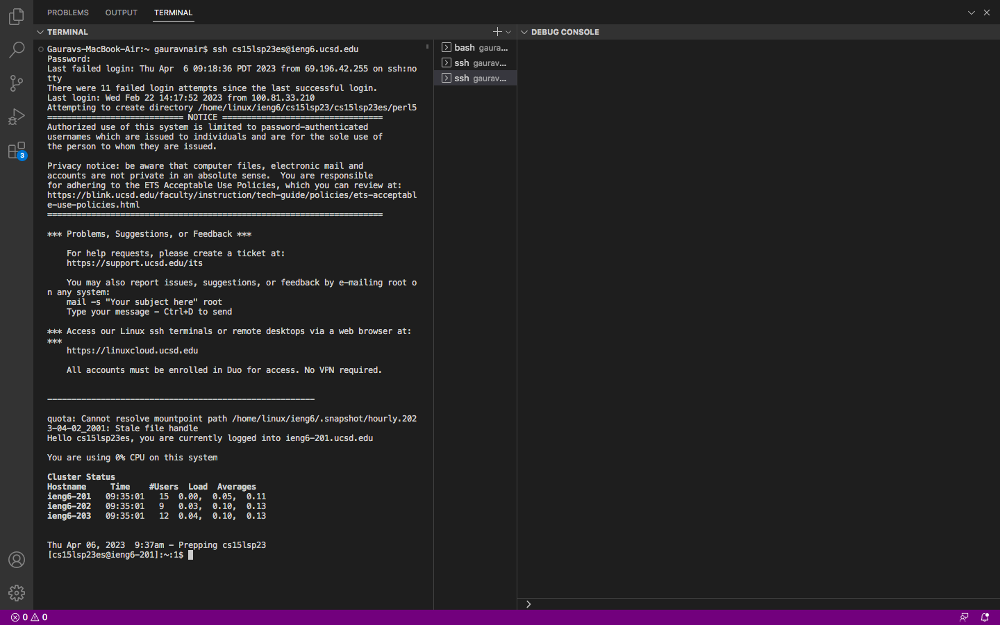
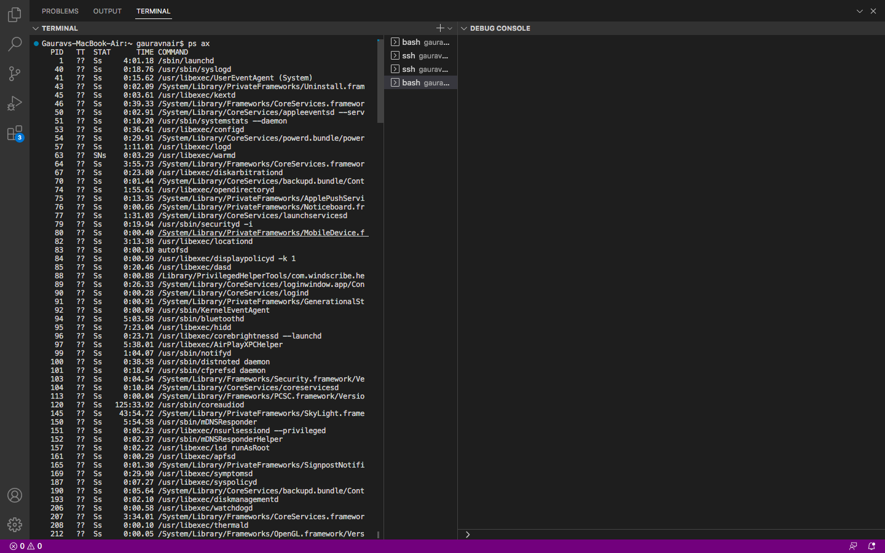

# **Tutorial for CSE 15L students to log into a course-specific account on ieng6**:
    
* Look up your course-specific account for CSE15L here and reset your password:

  https://sdacs.ucsd.edu/~icc/index.php

 **Installing VS code**:
  
 * Download VS code from the link below
  [Link]https://code.visualstudio.com/download
  
  Once intalled, open VS code. It should look like this:
  
  
  
  __Remotely Connecting__:
  
  * To remotely connect into a course-specific account on ieng6, type 'ssh ' followed by your course-specific id , followed by '@ieng6.ucsd.edu'.
  For example, the remote login for id cse15lsp23zz will be 'ssh cse15lsp23z@ieng6.ucsd.edu'.
  
  Once logged in remotely, the terminal should look like this:
  
  
  
  __Running commands__:
  
  _Try running the commands cd, ls, pwd, mkdir, and cp a few times in different ways, both on your computer, and on the remote computer after ssh-ing (use the terminal in VScode).
  
  
  
 
  
